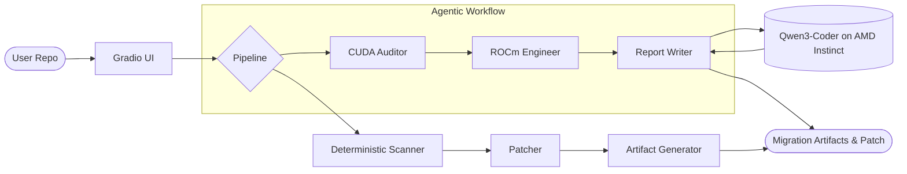

# ⚡ ROCmPort AI

> **AMD Developer Hackathon — lablab.ai** | Track: AI Agents & Agentic Workflows

ROCmPort AI is a **CUDA-to-ROCm migration scanner** powered by a three-agent CrewAI pipeline and Qwen3-Coder running on AMD Instinct GPUs. Drop in any CUDA-first PyTorch, Hugging Face, or vLLM repository and get a full AMD readiness report in seconds.

## What it does



| Output | Description |
|---|---|
| **AMD Readiness Score** | Before/after scores across 5 categories |
| **Findings table** | File + line references for every CUDA blocker |
| **ROCm patch diff** | Auto-generated unified diff to apply deterministic fixes |
| **Dockerfile.rocm** | ROCm-enabled container using vllm/vllm-openai-rocm |
| **AMD Developer Cloud Runbook** | Exact validation commands for AMD Instinct GPUs |
| **Migration report** | Narrative report (CrewAI + Qwen when configured) |
| **Benchmark schema** | Structured result to fill after AMD Developer Cloud run |
| **Artifact ZIP** | All outputs bundled for download |

## Three-agent pipeline

When `QWEN_BASE_URL` and `QWEN_API_KEY` are set (pointing to a Qwen3-Coder endpoint on AMD Instinct MI300X via vLLM), three CrewAI agents collaborate:

1. **CUDA Migration Auditor** — scans every file for blockers using `scan_cuda_repository` tool
2. **ROCm Migration Engineer** — generates the patch diff using `generate_rocm_patch` tool  
3. **Migration Report Writer** — synthesises findings into an actionable Markdown report

Without those env vars the app falls back to the fully deterministic scanner + patcher (which always runs).

## Run locally

```bash
pip install -r requirements.txt
python app.py
```

App listens on `http://127.0.0.1:7860`.

## Enable the full CrewAI + Qwen pipeline

```bash
# Windows
set QWEN_BASE_URL=https://your-amd-instinct-endpoint/v1
set QWEN_API_KEY=your-token
set QWEN_MODEL=Qwen/Qwen3-Coder-Next-FP8
python app.py

# Linux / macOS
QWEN_BASE_URL=https://your-amd-instinct-endpoint/v1 \
QWEN_API_KEY=your-token \
QWEN_MODEL=Qwen/Qwen3-Coder-Next-FP8 \
python app.py
```

## Tests

```bash
python -m pytest tests/ -v
```

7 tests cover the scanner, pipeline, and CrewAI agent layer.

## AMD Benchmark

The `data/benchmark_result.json` is a transparent **pending benchmark schema** — not a fabricated result. Run the generated AMD Developer Cloud runbook (shown in the app's Runbook tab) on an AMD Instinct MI300X instance to capture real throughput, latency, and VRAM figures, then replace the file.

## Deploy to Hugging Face Spaces

```bash
python scripts/deploy_to_hf.py --token hf_... --username YourHFUsername
```

## Tech stack

- **AMD Developer Cloud** + **AMD Instinct MI300X** for GPU compute
- **ROCm** — open-source GPU computing platform
- **CrewAI** — multi-agent orchestration
- **Qwen3-Coder-Next-FP8** — code-specialist LLM on AMD hardware
- **vLLM (ROCm build)** — high-throughput serving
- **Hugging Face** — model hub + Space hosting
- **Gradio 5** — web UI
